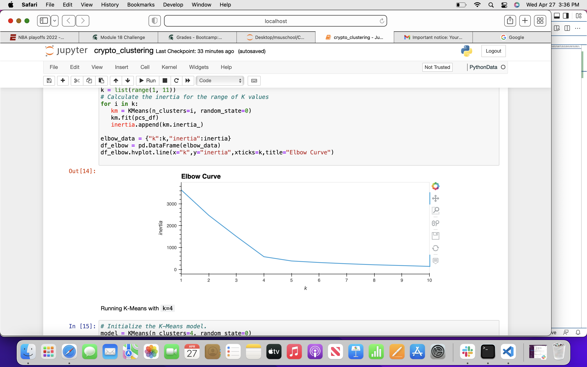
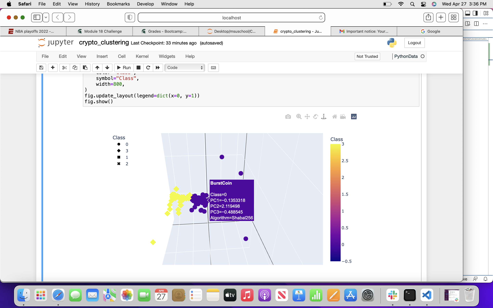

# Cryptocurrencies
Martha is attempting to process data, how to cluster and using PCA. This will help her convince her clients to get into cryptocurrency market. To do this, Martha has created a clustering algorithm and data visualizations to show her findings.
The elbow curve allows us to find the value of k as the image shows below

A 3d scatter plot uses plotly express scatter_3D

####Conclusions
This should help Martha convince her clients to use Crypto currencies as well give her an advantage in the crypto market. Martha can now be refrenced as "cryptobro".